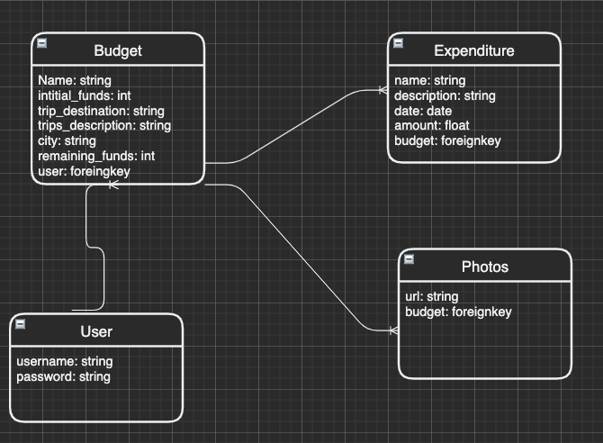

# Voyage Budgeter 

## Overview

In this application-- developed with Django, Python, and PostgreSQL--you will be able to create short term or long term budgets and plan each trip ahead of time! Not only that but you'll have different ways of knowing how much money you have, how much you've spent, percentages and more.

You will have to be a user to be able to create and view the budgets you've already made, but once you're logged in you'll be able to search through all your budgets and directly add expenses without having to go into the details page of each individual one.

I hope this app is helpful as equally as it was fun for me to produce. Happy budgeting!

## User Stories

- As a user

## App Screenshots

## App ERD

## User Stories / Wireframe

- [Trello](https://trello.com/b/z3AqpP5F/unit-2-project)

## Technologies Used

  - Javascript
  - HTML
  - CSS
  - Mongoose
  - MongoDB
  - Express
  - Passport Google Oauth
  - EJS
  - Bootstrap
  - Popper

## Getting Started

Click on the link below to check out Pic-Less!

[Pic-Less](https://frozen-dawn-11241.herokuapp.com)

## Next Steps

A future step is going to be to have the ability to dislike a post, since once you like it it doesn't give you the option to delete the like

In addition, I would like to enable the <em>hide</em> feature (the eye with the slash), to be able to hide somebody's post when a user clicks on it. The post will be displayed to every user except the one that clicked on the eye.

Also, I would like to add an unhide function which undoes what the hide button does

## App ERD

## Technologies Used

- PostgreSQL
- Django
- Python
- Javascript - jQuery
- HTML
- CSS
- Bootstrap
- Popper