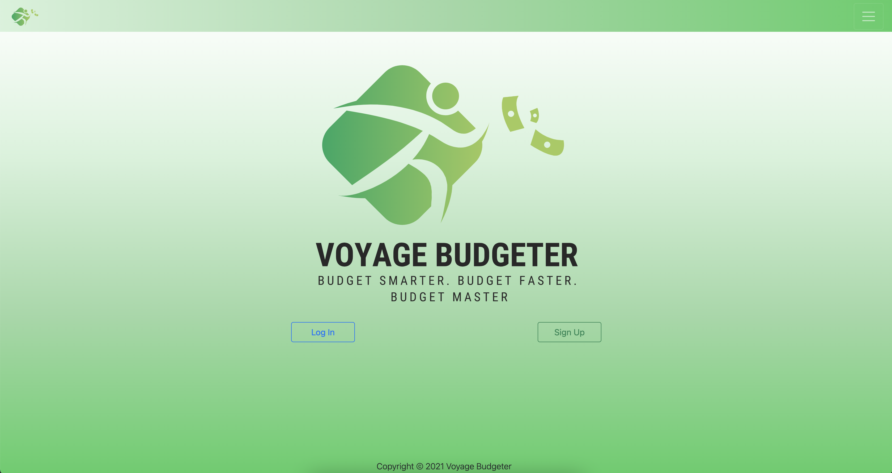
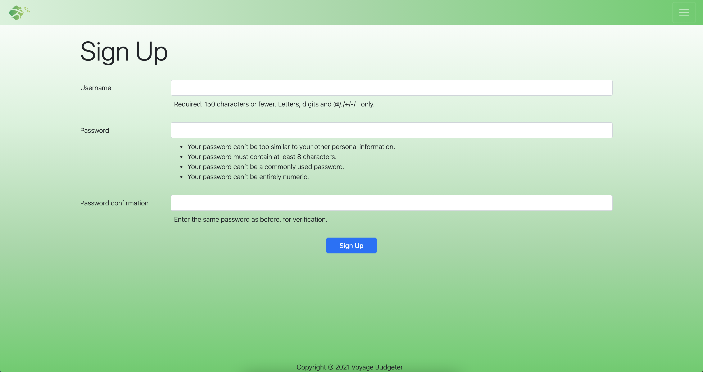
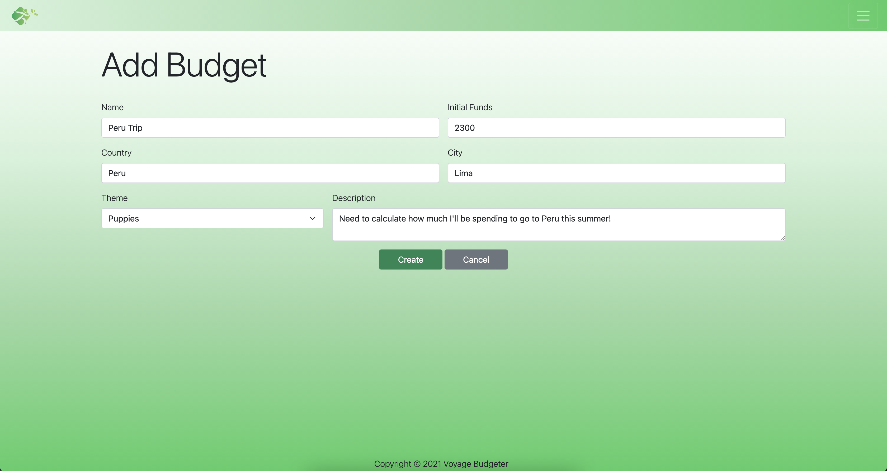
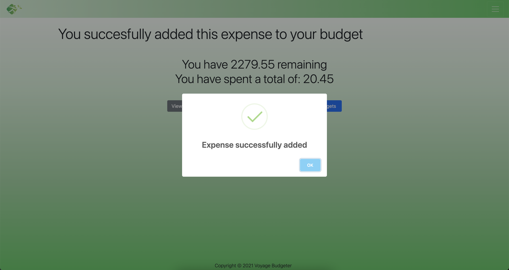
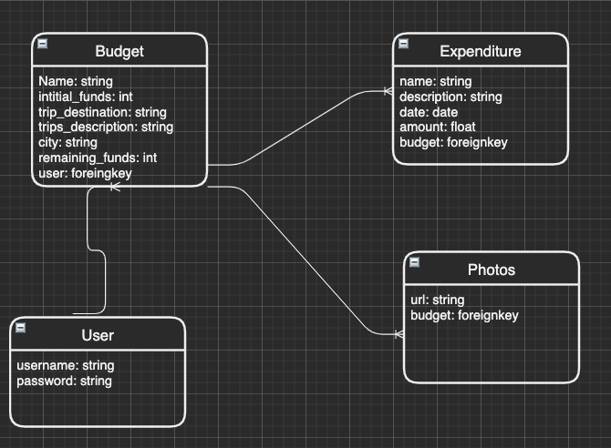

# Voyage Budgeter 

## Overview

In this application-- developed with Django, Python, and PostgreSQL--you will be able to create short term or long term budgets and plan each trip ahead of time! Not only that but you'll have different ways of knowing how much money you have, how much you've spent, percentages and more.

You will have to be a user to be able to create and view the budgets you've already made, but once you're logged in you'll be able to search through all your budgets and directly add expenses without having to go into the details page of each individual one.

I hope this app is helpful as equally as it was fun for me to produce. Happy budgeting!

## Pitch Deck & Wireframes

- [Voyage Budgeter Pitch](https://docs.google.com/presentation/d/1Ps3-J4FnsKgRtjAoiFuu3sYHmRhOuYgYofD_BKhfbLQ/edit#slide=id.p)

## User Stories

- As a user I will be able to sign up
- As a user I will be able to log in
- As a user I will be able to create a new budget
- As a user I want to be able to edit information on my budget
- As a user I should be able to delete a budget
- As a user I will be able to add expenses for each budget
- As a user I want to be able to delete an expense
- As a user I will be able to upload photos for each individual budget
- As a user I want to see my funds lower with every purchase I make
- As a user I want to be notified if I'm reaching my budget limit
<!-- - As a user I will be able to leave a review for the website -->

## App Screenshots

## App ERD

## Technologies Used

  - PostgreSQL
  - Django
  - Python
  - Amazon S3
  - Heroku
  - HTML
  - CSS
  - Javascript - jQuery
  - HTML
  - CSS
  - Bootstrap
  - Popper
  - SweetAlert

## Getting Started

Click on the link below to check out Voyage Budgeter!

[Voyage Budgeter](https://voyagebudgeter.herokuapp.com)

## Next Steps

A future step is going to be implementing the ability to have budgets within budgets without limits to how deep you can go within each one.

In addition, I would like to add a feature where you can login with an authenticator such as Google or Facebook.

Also, I would like to include more functionality to the reviews section, so you can add comment in each comment and it have no limit to it as well.

